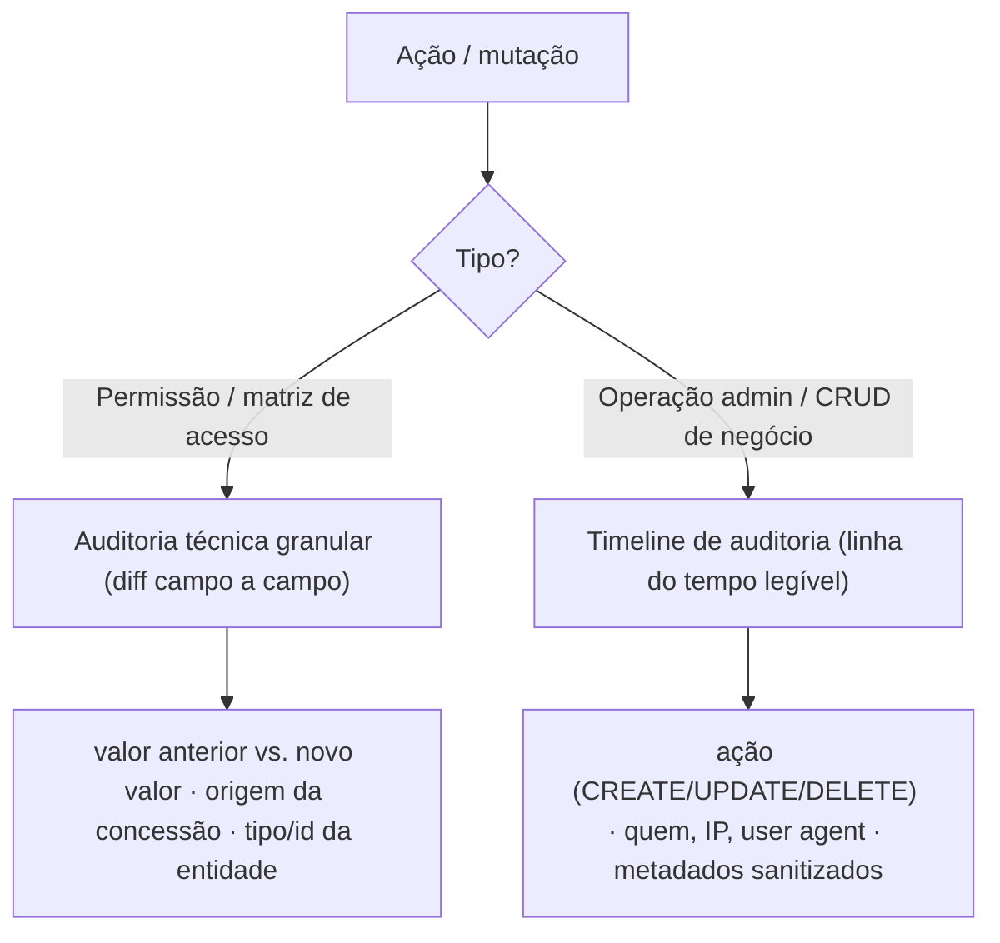

# Padrão de trilha de auditoria (duas camadas)

Dois sistemas do grupo resolveram auditoria/rastreabilidade de forma equivalente, com a mesma
separação conceitual em duas camadas — mesmo com nomes de tabela diferentes entre eles.

## Camada 1 — auditoria técnica granular

Para mudanças de permissão/acesso: registre o diff técnico completo — tipo de entidade afetada,
id da entidade, valor anterior, valor novo, e a origem da mudança (manual vs. automática/regra).
Serve para responder "exatamente o que mudou e por quê" numa auditoria de segurança.

## Camada 2 — timeline de auditoria de negócio

Para operações administrativas/CRUD de negócio: registre uma timeline legível por humano —
ação (CREATE/UPDATE/DELETE ou equivalente do domínio), quem fez (ator, IP, user agent), e
metadados relevantes da operação, sempre sanitizados. Serve para responder "o que aconteceu com
este registro ao longo do tempo".

## Regras de governança

1. Não duplique o mesmo evento nas duas camadas — cada mutação pertence a uma delas, conforme o
   tipo de mudança (ver diagrama). Documente essa decisão de roteamento no projeto.
2. O identificador do ator (`actorId`), IP e user agent vêm sempre do contexto da requisição
   (guards, `AsyncLocalStorage` ou equivalente) — nunca hardcoded ou passado manualmente por quem
   chama o serviço de auditoria.
3. Registros de auditoria são append-only — nunca `UPDATE` ou `DELETE` num registro de auditoria
   já criado.
4. Nenhum dado sensível (senha, token, dado pessoal não necessário) entra nos metadados — sanitize
   antes de persistir.

## Critério de aceite

- Toda mutação crítica gera o registro de auditoria correspondente na camada certa.
- Nenhum dado sensível nos metadados.
- O identificador do ator está sempre corretamente preenchido, nunca vazio ou genérico.
