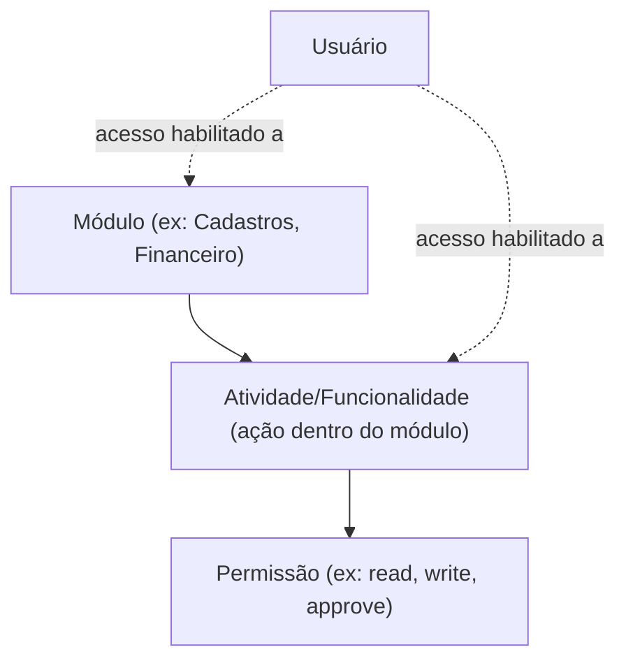

# Padrão de catálogo de permissões (módulo → atividade → permissão)

Mais de um sistema do grupo resolveu controle de acesso granular com a mesma hierarquia
conceitual, mas com implementações técnicas diferentes. Formalizar o padrão comum evita uma
terceira reinvenção divergente no próximo sistema.

## Hierarquia conceitual comum

Um usuário tem acesso a um módulo (concessão de nível 1) e, dentro dele, a atividades específicas
(concessão de nível 2) — desabilitar o módulo implicitamente esconde suas atividades, mas
habilitar o módulo não habilita automaticamente todas as atividades.

## Dois modelos de implementação observados

**Manifesto versionado em código**: o catálogo (módulos, funcionalidades, ações, páginas) vive
num arquivo TypeScript versionado no repositório, com um comando para regenerar artefatos
derivados e outro para validar drift entre o manifesto e o que está de fato registrado/exposto
pela aplicação.

**Tabelas relacionais**: o catálogo vive no banco de dados — tipicamente um model de Módulo
(agrupável em grupos de módulo), um model de Atividade pertencente a um módulo, um model de
Permissão associada a atividades via tabela N:N, e dois models de concessão por usuário (acesso
ao módulo, acesso à atividade) referenciando os anteriores.

Nenhum dos dois modelos é superior em abstrato — a escolha depende de quem administra o catálogo
(times de produto preferem tabelas com UI de administração; times de engenharia preferem
manifesto versionado com review de PR). O que importa é que qualquer sistema novo do grupo com
necessidade equivalente escolha conscientemente um dos dois, em vez de inventar um terceiro
formato.

## Procedimento (comum aos dois modelos)

1. Identifique se a mudança afeta um módulo, uma funcionalidade/atividade, uma ação, ou uma
   página.
2. Leia a documentação de domínio e técnica do catálogo de permissões do projeto.
3. Atualize o catálogo (arquivo versionado ou tabela) seguindo a estrutura já documentada pelo
   projeto — não invente uma estrutura nova.
4. Regenere artefatos derivados quando o projeto tiver esse passo (ex: regenerar um manifesto,
   ou popular uma tabela via seed).
5. Valide drift entre o catálogo declarado e o que a aplicação de fato expõe/registra, se o
   projeto tiver essa checagem.
6. Rode type checking e os testes relevantes.
7. Verifique a integração API/UI — uma permissão nova só tem efeito se checada nos dois lados.

## Verificação

- Type check passa.
- Validação do catálogo/registry passa (quando existir).
- Nenhuma funcionalidade ou rota órfã (referenciada no catálogo mas inexistente no código, ou
  vice-versa).
- O resultado corresponde à especificação de produto que motivou a mudança.
