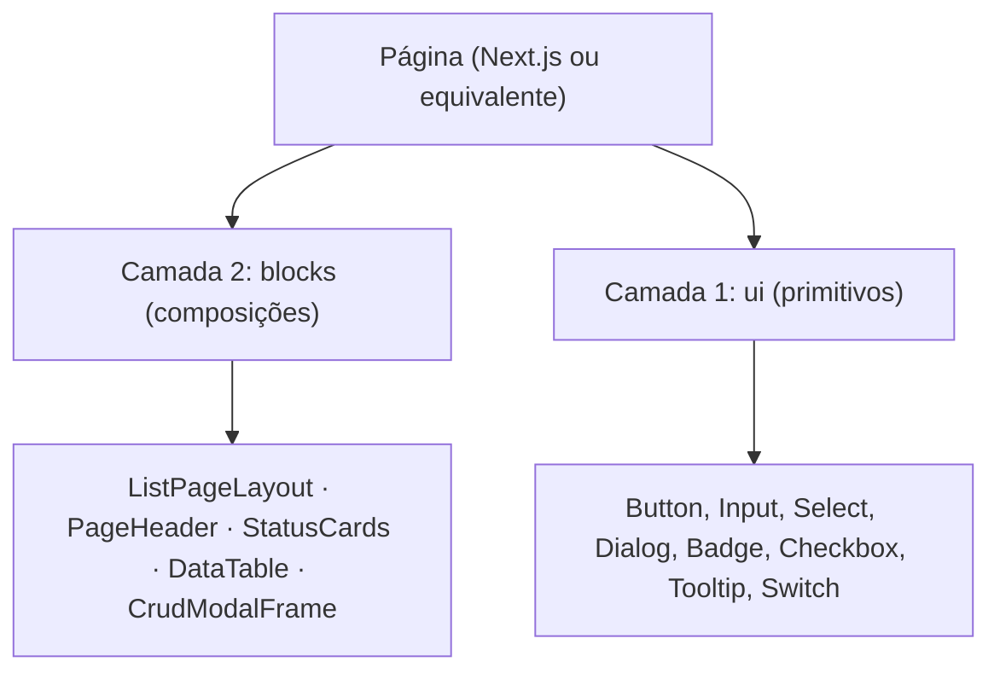

# Guardião do Design System Orion

Aplica-se a qualquer portal do grupo que já consome `@design-systems-orion` — não é sobre migrar
para o Orion (ver `orion-design-system-adoption`), é sobre garantir que o uso permaneça correto
depois de adotado.

> **Regra de ouro inegociável:** toda tela e componente novo DEVE usar exclusivamente a
> arquitetura oficial do Orion. Proibido `<table>` cru, layout ad-hoc, ou componentes legados de
> uma biblioteca de UI que o portal já tenha substituído.

## Fontes da verdade

Consulte a documentação de UI patterns do próprio projeto (tipicamente algo como
`docs/technical/ui-patterns/*.md`) e os barrels oficiais de import do design system no projeto —
esta skill define as regras gerais; os caminhos exatos variam por consumidor.

## Estrutura de camadas

## Regras canônicas

1. **Import único por camada:** composições de `@design-systems-orion/blocks`, primitivos de
   `@design-systems-orion/ui`. Nunca de uma biblioteca de UI legada ou de uma cópia local.
2. **Base UI, nunca Radix direto.** A API polimórfica usa a prop de render do Base UI, nunca
   `asChild` (convenção Radix).
3. **Ícones:** sempre de uma biblioteca de ícones consistente (ex: `lucide-react`), nunca SVG
   inline.
4. **Listagem:** sempre `ListPageLayout` + `PageHeader` + `StatusCards` + `DataTable`.
5. **CRUD:** sempre `CrudModalFrame` + `CrudModalHeader`, com validação de formulário (Zod ou
   equivalente) + biblioteca de formulários do projeto.

## Anti-patterns que devem ser bloqueados

- `<table>`, `<thead>`, `<tbody>` manuais.
- `asChild` em trigger/dialog (é convenção Radix, não Base UI).
- SVG cru em qualquer componente.
- Cópias locais de botão/input/card dentro de pastas de feature — sinal de que o design system
  não cobre um caso e o gap deveria ir para o backlog do Orion, não virar duplicata local.

## Como revisar

Ao revisar uma tela, aponte a violação citando o arquivo e a linha, e a alternativa Orion
correta — "está quase igual" não é aprovação. Isto complementa (não substitui) uma revisão de
code review genérica: o eixo "Standards" de qualquer mecanismo de code review do grupo deve
incluir esta checklist quando a tela revisada usa o Design System Orion.
