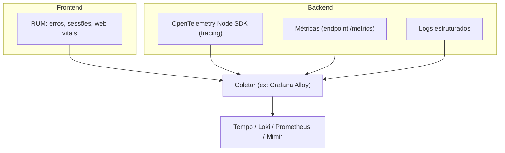

# Padrão de observabilidade OpenTelemetry + LGTM

## Os quatro pilares

## Regras

- O SDK de tracing nunca deve iniciar em ambiente de teste (`NODE_ENV === 'test'` ou
  equivalente) — instrumentar durante testes automatizados adiciona overhead e ruído sem
  benefício, e pode causar vazamento de conexões nos testes.
- Adicione spans customizados para operações pesadas (processamento de arquivo, chamadas a
  integrações externas lentas, queries complexas) — spans automáticos de framework raramente
  capturam o nível de detalhe necessário para diagnosticar lentidão nessas operações.
- RUM (monitoramento no frontend) deve mascarar dados sensíveis (senhas, documentos pessoais,
  tokens) antes de enviar ao coletor — RUM captura interação do usuário real, então o mesmo
  cuidado de "nunca logar dado sensível" se aplica.
- Logs sempre estruturados (JSON) com payload contextual mínimo: identificador do ator,
  identificador de correlação/trace, e duração da operação quando relevante. Log de texto livre
  sem estrutura é difícil de correlacionar com traces.
- Métricas de negócio e de infraestrutura expostas num endpoint dedicado para o coletor de
  métricas.

## Critério de aceite

- Endpoints críticos e fluxos assíncronos têm identificador de correlação/trace propagado.
- Nenhum dado sigiloso aparece em log ou span em texto plano.
- O SDK de tracing fecha graciosamente ao receber sinal de término do processo.
