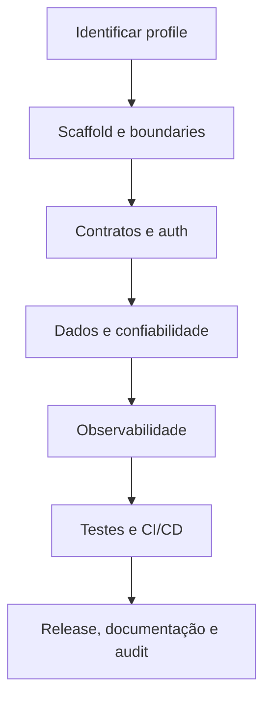

# Orion Golden Path

Fluxo para nascer ou evoluir sistema Orion sem impor uma stack única. Escolher profile determina quais standards são aplicáveis.

```mermaid
flowchart TD
  P[Identificar profile] --> S[Scaffold e boundaries]
  S --> C[Contratos e auth]
  C --> D[Dados e confiabilidade]
  D --> O[Observabilidade]
  O --> T[Testes e CI/CD]
  T --> R[Release, documentação e audit]
```
