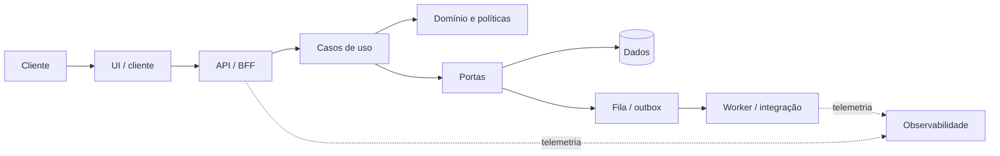

# Orion Reference Architecture

Padroniza outcomes e boundaries; não obriga stack única. Escolha profile conforme responsabilidade e carregue somente standards aplicáveis.

Perfis: `web-portal`, `backend-api`, `integration-service`, `worker`, `mobile-app`, `static-tool`.

Regras de boundary: UI não persiste nem decide autorização; rota traduz transporte; caso de uso orquestra; domínio não depende de ORM/HTTP; infraestrutura implementa portas; efeito fora da transação possui estratégia de idempotência/falha.
